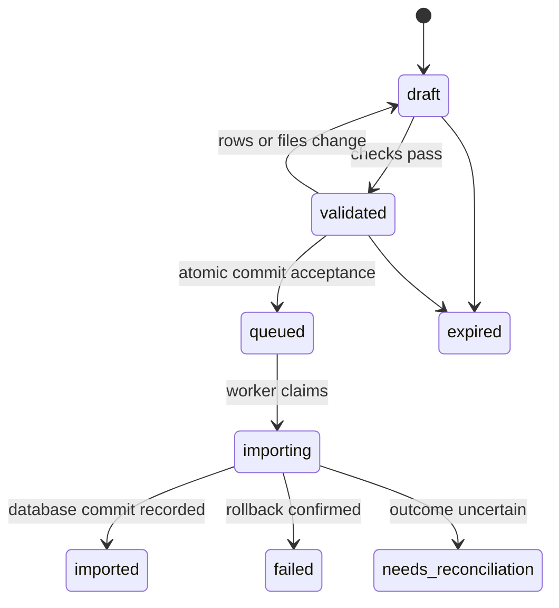

# Wildbook submissions API

Status: senior engineer accepted the sibling API, new-API defaults and limited
partner pilot on 2026-09-23, as relayed by the user. Detailed implementation
mechanics remain proposed; no runtime changes implemented.

Reviewed 2026-09-23 against checkout `24cc99aede`, the Wildbook development skill,
the import-format skill, and the [lead engineer's proposal](https://qa.wildme.org/bulk-import-next.html).
The proposal was retrieved directly; deployment behavior was not tested.

## Recommendation

Add a small `/api/v3/submissions` API for authenticated data intake. Reuse the
bulk-import row contract and Java importer. Keep the existing React bulk-import
routes, defaults, authentication, and response shapes stable.

A submission is a server-owned draft containing metadata and uploaded media.
Clients create a draft, upload files, validate it, commit it once, and retrieve
the resulting Wildbook records. One encounter and 200 encounters use the same
workflow. A submission is an intake envelope, not a new biological entity.

This adds orchestration around the existing importer, not another implementation
of encounter creation. The main new responsibilities are ownership before an
ImportTask exists, immutable commit input, retry protection, and a predictable
machine-readable lifecycle.

Initial scope: trusted integrations, agents acting for authenticated users, and
humans using a CLI or future form. Anonymous public submission, general record
updates, automatic identity decisions, and replacement of the working bulk UI
are separate projects. Existing import-supported individual/occurrence linking
remains available only within the caller's permissions.

## What already exists

| Capability | Evidence in this checkout | Design consequence |
| --- | --- | --- |
| JSON intake | `api/BulkImport.java#doPost`: object rows, or `fieldNames` plus array rows | No CSV/XLSX parser needed for programmatic intake |
| Field and row validation | `api/bulk/BulkValidator.java`, `BulkImportUtil.validateRow` | Reuse these as the domain-validation authority |
| Validation mode | `validateOnly` with field/row diagnostics | Reuse validation logic; new preview contract must also describe media checks |
| Creation | `BulkImporter.createImport`, `UploadedFiles.makeMediaAsset` | Reuse encounter, occurrence, individual, project, and media handling |
| Async tracking | `ImportTask`; `processInBackground`; status GET | Link submissions to ImportTasks; distinguish data import from IA completion |
| Uploads | `UploadServlet`, `UploadPaths`, `FlowInfoStorage` | Preserve working browser upload path; reuse mechanics where appropriate |
| JWT verification | `WildbookTokenAuthenticationFilter`, `JwtService`, `AuthToken` | Reuse verification and identity resolution, with explicit write authorization |
| Import visibility | `ServletUtilities.isUserAuthorizedForImportTask` | Existing policy includes creator, collaboration, and organization/admin checks |

Paths in this table are relative to `src/main/java/org/ecocean/`.

The current servlet contains orchestration as well as validation. Its helper
methods are not already a clean service API. `BulkImporter.createImport` also
starts media-child/indexing work, while its caller commits the main transaction.
Any new execution adapter must preserve and test those lifecycle dependencies.
Calling `createImport` alone is not the complete import workflow.

## How this develops the engineer's proposal

Keep its core decisions: additive backend work, normalized JSON rows, reuse of
the importer, simple multipart uploads, documented resumable uploads, and no
initial React changes. Make the following refinements:

1. **Separate the new orchestration contract.** A sibling submissions endpoint
   avoids adding new draft/commit semantics to a working servlet. The cost is a
   small new resource and adapter; the benefit is that new defaults and status
   codes do not affect browser imports. Merely documenting and token-enabling
   the old POST is smaller, but does not provide the retry and draft lifecycle
   expected by unattended clients.
2. **Write permission must be explicit.** A different filter name or URL does
   not distinguish a read token from an import token. Require a signed import
   capability issued after explicit authentication and permission checks.
   Existing tokens without that capability remain ineligible for submissions.
3. **Keep location policy local to the new contract initially.** Require a
   configured `Encounter.locationID` for the new MVP. Do not change the shared
   required-field set merely to make the new API stricter. Shared behavior
   changes need their own compatibility review.
4. **Count media per encounter after grouping rows.** A submission-wide file
   count is not `maximumMediaCountEncounter`. Apply distinct limits for file
   bytes, request bytes, draft storage, row count, and encounter media count.
5. **Define retry and filename semantics.** An existing filename or ImportTask
   ID is not a sufficient idempotency contract. Verify content, freeze the draft,
   and track the commit operation durably.

Some proposal baseline details differ from this checkout: upload requests already
use configured chunk/request byte bounds; `FlowInfoStorage` keys include both
identifier and staging path; task authorization is broader than creator-only.
Token TTL is selected by server configuration, not by a client request parameter.
Chunk/request bounds still need to be distinguished from complete-file and
submission quotas in the new contract. The skill's 200-row recommendation is a
useful starting default, not evidence of a universal backend maximum.

## API contract

All routes below are **proposed**, not available today. Publish them through the
existing OpenAPI documentation mechanism. Require authentication and return JSON
errors, including for expired sessions; never redirect an API client to login.

| Method and route | Purpose and result |
| --- | --- |
| `GET /api/v3/submissions/capabilities` | Contract version, enabled operations, row schema, configured values and limits |
| `POST /api/v3/submissions` | Create owned draft; `201`, ID, revision, expiry, links; require `Idempotency-Key` |
| `GET /api/v3/submissions/{id}` | Draft/operation status and links; present immediately after creation |
| `PUT /api/v3/submissions/{id}/rows` | Replace complete normalized row set in a draft; require `If-Match` revision |
| `POST /api/v3/submissions/{id}/files` | Stream one multipart file; require draft revision and return new revision |
| `GET /api/v3/submissions/{id}/files` | Manifest: name, size, digest, upload/validation state |
| `POST /api/v3/submissions/{id}/validate` | Validate a revision; `200` with `valid`, issues, counts, validation ID |
| `POST /api/v3/submissions/{id}/commit` | Commit validated revision; require `If-Match` and `Idempotency-Key`; `202`, status URL |
| `GET /api/v3/submissions/{id}/results` | Paginated record IDs, row references, diagnostics and downstream status |
| `DELETE /api/v3/submissions/{id}` | Cancel an uncommitted draft and expire staged files; never delete imported records |

Mutation during validation/commit is serialized per submission. A stale revision
returns `412`; conflicting operation or filename content returns `409`.
Malformed JSON returns `400`, unacceptable commit data `422`, oversized input
`413`, and quota/concurrency throttling `429` with `Retry-After`. Validation
returning HTTP 200 means the check ran, not that the data passed.

Example draft creation body:

```json
{
  "contractVersion": "1",
  "source": {"name": "field-survey-tool", "batchId": "survey-2026-09-23-a"},
  "processing": {"mode": "import-only"}
}
```

Example body for `PUT .../{id}/rows`:

```json
{
  "rows": [
    {
      "clientRowId": "observation-001",
      "fields": {
        "Encounter.year": 2026,
        "Encounter.month": 9,
        "Encounter.day": 23,
        "Encounter.locationID": "configured-location-id",
        "Encounter.genus": "Loxodonta",
        "Encounter.specificEpithet": "africana",
        "Encounter.mediaAsset0": "observation-001.jpg"
      }
    }
  ]
}
```

`fields` passes to the current object-row validator. The small wrapper carries
provenance without inventing new bulk field names. `clientRowId` is unique within
a submission and survives validation and result mapping. The location and
taxonomy in this example must be replaced with values configured on the target
installation. Default submitter is the authenticated user; declaring another
owner requires explicit authority. Source metadata never establishes authority.

Expose three processing choices: `import-only`, `detect`, and
`detect-and-identify`, mapped to existing skip flags. Default the new API to
`import-only` to avoid unrequested processing; retain legacy defaults. Discovery
lists which choices are supported by the installation/taxon. A match result is
not automatic confirmation of an individual's identity.

The MVP supports image-backed encounters. Require at least one completed image
reference per resulting encounter. Metadata-only records, videos, and externally
hosted URL ingestion can be added as explicit capabilities later. Preserve date
precision: a year alone remains a year, not an invented January 1 observation.

## Validation and discovery

Run three layers, returning stable issue codes plus readable messages:

1. **Envelope and permission checks:** nonempty bounded rows, unique client row
   IDs, ownership, configured location, field allowlist, authorized links to
   existing records/projects, and complete manifest references.
2. **Existing domain checks:** `BulkImportUtil.validateRow` and `BulkValidator`.
   Copy input before validation because validation can mutate JSON key sets.
   Resolve defaults once and show the effective values in the preview.
3. **Media and aggregate checks:** decode staged images without creating domain
   objects; validate actual bytes and digest, merged encounter media counts,
   and total job limits. Do not describe filename existence as image validity.

Unknown field names are errors in the new API. Reject invalid rows as a whole
submission for the MVP; do not expose permissive legacy tolerance knobs yet.
Validation can write its report and operational audit, but creates no Encounters,
MediaAssets, Individuals, Projects, or IA jobs.

Discovery should derive field names, synonyms, types and enums from existing
validator/configuration sources where available. Add a thin metadata description
where those sources lack types/help text, with drift checks; do not hand-maintain
a second independent validator. Expose conditional requirements and dynamic
measurements/keywords as well as simple JSON types. Do not publish inaccessible
project or user directories as a side effect of discovery.

Each issue includes `code`, `clientRowId`, zero-based `rowIndex`, `field`,
`message`, and optionally `allowedValues` or a limit. Return normalized preview,
errors, warnings, effective owner, processing choice, and expected entity counts
where determinable. Humans review this preview; agents use the same response.

Validation records the draft revision, manifest hash and relevant configuration
version/hash. Commit rechecks authorization and current validation rules. If
configuration or effective input changed, require a fresh validation rather than
silently committing a different interpretation. A successful preview cannot
guarantee later infrastructure or database success.

## Authentication and ownership

Reuse `JwtService` verification with a new submissions filter. Add explicit import
capability issuance, either an additive opt-in to `AuthToken` or a dedicated
issuance route sharing its credential verification. Prefer the additive option
with unchanged behavior when omitted. A capability such as `submissions:write`
requires current account permission and installation enablement; a client cannot
self-assert it. No change to read-token behavior or existing search wiring.

Browser session requests use existing identity and CSRF protections as applicable;
the new writes must enforce CSRF protection when cookie authentication is used.
Bearer authentication remains stateless. When a Bearer header is present, a bad
token fails rather than falling back to cookies. Resolve roles against the token
identity, including mixed cookie/token requests. Do not inherit another session's
role checks. Recheck account authorization at commit/execution.

Persist owner/context before accepting bytes. Check them on every draft, upload,
manifest, validation, commit, and result operation. Initially drafts are private
to their creator plus explicit administrative access. Imported records retain
existing Wildbook visibility rules. Broader draft sharing is a separate feature.

For the pilot, use dedicated integration accounts and short-lived tokens minted
by a trusted integration service. Keep passwords out of agent prompts and browser
third-party apps. Token expiry does not cancel an accepted job; the same identity
can reauthenticate and resume polling/uploading. Broader third-party delegated
authorization, revocation UX, and OAuth can follow without changing row intake.

## Upload handling

Start with one-file multipart requests, streamed to staging with bounded memory.
Reuse path validation, image validation and asset-store handling. Preserve original
filenames in a manifest; reject duplicate logical names with different content,
including collisions after filename cleaning or case normalization on the target
filesystem. Same name and digest is a retry success, not a second file.

Freeze the file manifest at commit. Upload completion must be atomic: partial
files never become valid references. The server computes size and digest; client
claims are advisory. Enforce per-file, request, draft, per-user storage, row, and
active-job limits. Apply media-per-encounter limits after legacy row grouping.

Use owned staging for the new API. Do not expose its drafts through the old
anonymous upload namespace. Refactor only the small path/storage seams needed to
pass explicit staged files to the importer. Old upload URLs and destination
conventions stay stable. If an implementation instead shares directories, it must
enforce the draft's ownership and freeze across **all** routes that can write
there; protecting only the new route is insufficient.

Add resumable uploads in a follow-up under the same owned submission. Reuse the
existing flow chunk engine behind a submission-aware adapter, documenting exact
chunk geometry and response behavior from code/tests. Scope identifiers to the
submission and file digest. Do not switch `/upload` or `/ResumableUpload` auth
chains as a prerequisite for the new feature.

Existing in-memory chunk state is not durable server-restart resume. Stable
identifiers aid client retries, but cannot restore lost server state. Pin pilot
uploads to one instance; a multi-instance deployment needs shared state or
explicit routing plus recovery behavior. Advertise the actual resume guarantee.

## Durable commit and recovery

Add a JDO-backed `Submission` record with owner/context, source, revision, manifest
reference, immutable payload reference/hash, validation reference, state,
ImportTask ID, operation key, timestamps, and last error. Store large payloads in
bounded private storage rather than assuming a giant database JSON field.

Create-request idempotency is scoped to installation, principal, and operation.
Persist the key and canonical request hash with the new draft under a database
unique constraint. Same key and input returns the original result; changed input
returns `409`. Advertise retention and expiration semantics.

For commit, atomically lock the draft, verify its revision and validation, reserve
one ImportTask ID, freeze the payload/manifest, and persist `queued` before
returning `202`. A second commit, even with a different key, cannot start a second
import from that submission. Replaying the original key returns the accepted
operation before applying stale-revision checks. Keep a durable committed
tombstone when uploaded staging expires.

Use a bounded worker with database-backed claim/lease state. The worker opens its
own Shepherd and reloads validated input; do not pass JDO objects across request
threads. The lifecycle is:



Record successful import and result IDs in the same database transaction as the
domain objects where feasible. Preserve existing ImportTask progress transactions
without treating them as proof that the domain commit succeeded. Keep explicit
row-to-entity mapping; do not zip legacy result arrays to input rows because rows
can group into an encounter and caches do not provide that positional contract.
A narrow optional mapping callback/result in `BulkImporter` is appropriate.

The importer currently launches some post-processing before the caller's final
commit. For the new adapter, add a narrowly tested opt-in deferred-side-effects
hook, preserving the legacy default, so work can be scheduled after the commit.
Persist downstream intent in the commit transaction; reconcile it on restart.
Do not promise exactly-once IA execution until its dispatch/deduplication boundary
is demonstrated. Report an uncertain dispatch rather than silently rerunning it.

Queued jobs may be reclaimed safely. An expired lease on an importing job is not
permission to rerun `createImport`: first establish whether its transaction
committed and whether the previous worker has stopped. Use a fenced claim for
any automatic recovery. If outcome cannot be proven, mark
`needs_reconciliation`, preserve staged files, and require operator recovery.
This conservative behavior belongs in the first release; unattended full recovery
can follow. Never describe the current raw background thread as a durable queue.

Filesystem copies and database commits are not one transaction. Track created
asset paths and clean up unreferenced files after confirmed rollback, with a grace
period. Do not delete shared/pre-existing media. Expiry cleanup excludes queued,
active, committed and uncertain jobs until their retention policy permits it.

Return separate import, indexing, detection and identification states. Imported
records remain imported if IA fails. Unknown downstream state must be explicit;
an absent status does not mean success. Polling with `Retry-After` is sufficient
for the MVP; webhooks can follow. Results link to existing task/encounter pages.

Idempotency is scoped to a submission/operation, not global image or observation
deduplication. The same photograph can legitimately represent multiple encounters.
For recurring partner feeds, later add a namespaced external-record mapping with
an explicit conflict/update policy; do not make intake implicitly upsert records.

## Implementation boundary and rollout

1. **Characterize the current path.** Capture object-row/array-row validation,
   grouping, owner defaults, media handling, task lifecycle, indexing and IA
   behavior with existing fixtures. Establish frontend/backend test baselines.
   Finish the OpenAPI examples and agree on the supported MVP field set.
2. **Add drafts, auth, discovery and simple uploads behind a flag.** Implement
   ownership, revision control, quotas and validation without enabling commit.
   No new write authority is granted to existing tokens.
3. **Add an import execution adapter.** Reuse `BulkImportUtil`, `BulkValidator`,
   `UploadedFiles.makeMediaAsset` and `BulkImporter`; move only necessary private
   lifecycle helpers to a small service with explicit user/context/files/options.
   Separate mechanical extraction from behavior changes in review. Leave the
   existing servlet's sequencing and defaults covered by characterization tests.
   Implement durable admission, result mapping and conservative recovery before
   enabling external commits. Prove post-commit side-effect behavior.
4. **Pilot one installation and one integration.** Default to 200 rows per job
   as an operational starting point; publish actual configured limits. Exercise
   timeouts, crashes and expiry. Observe import latency, failures, quota use,
   reconciliation cases, search visibility and IA handoffs.
5. **Expand ergonomics.** Add a reference Python/CLI client and agent instructions
   from the OpenAPI contract. Humans can use the CLI immediately; a future form
   can use the same preview/commit endpoints. Add resumable upload, delegated
   third-party auth and optional callbacks after the core contract is proven.

Do not rewrite `BulkImporter.processRow`, migrate the React UI, replace asset
storage, or change global location/tolerance defaults as part of this effort.
The unavoidable new work is the submission lifecycle; call it out in estimates
rather than presenting it as a few auth-filter changes.

## Acceptance gates

| Area | Required proof |
| --- | --- |
| Compatibility | Existing browser import, session/captcha uploads, object/array row payloads, validation errors and task pages retain behavior |
| Authorization | Read-only JWT rejected; import JWT accepted within authority; cross-owner draft operations denied; cookie CSRF and mixed identities tested |
| Validation | No domain writes during preview; unknown fields, configured locations, date precision, missing media and grouped media limits enforced |
| Retry | Lost create/commit responses and concurrent repeated requests create one draft/import; changed keyed payload rejected |
| Recovery | Crash before dispatch, during import and after domain commit cannot cause blind duplicate imports; uncertain work remains inspectable |
| Upload | Actual-byte limits, incomplete files, duplicate names/content, normalized-name collisions, freeze and staging cleanup tested |
| Lifecycle | Imported versus indexed/detected/identified distinguished; IA failure never reports data rollback; row-to-record mapping handles grouping |
| Persistence | JDO enhancement and clean build; every Shepherd closes; added mappings/constraints tested against PostgreSQL |

Relevant existing tests include `api/bulk/BulkApiPostTest`, `BulkApiOtherTest`,
`BulkGeneralTest`, `BulkImagesTest`, `BulkImporterMissingAssetTest`, upload path
and chunk-geometry tests, token-filter/issuance tests, and frontend bulk-import
and task polling suites. Run meaningful integration/recovery tests in addition
to those existing suites when implementing; a design-only change needs no build.

Disable new admission to roll back the feature while letting accepted work drain
or reconcile. Keep legacy imports available. Do not remove new persistence data
or revoke access to status/results while jobs remain unresolved.

## Accepted product direction — 2026-09-23

The senior engineer accepted these three decisions:

- A sibling submissions API, reusing the bulk-import pipeline.
- Configured location, strict validation and import-only defaults for the new
  API, with legacy behavior unchanged. Universal backend location enforcement
  may be worth a separate correction later; it is not part of this rollout.
- A pilot with a few approved partners: explicitly enable their accounts for the
  new API rather than opening access to everyone at launch.

The remaining MVP recommendations (image-backed submissions, polling, simple
uploads and no deletion of committed records) are detailed above. Before rollout,
select pilot partners and installation, set byte/storage/concurrency limits and
retention with operators, and verify the actual deployment topology. Public
third-party browser authorization remains a later milestone.
